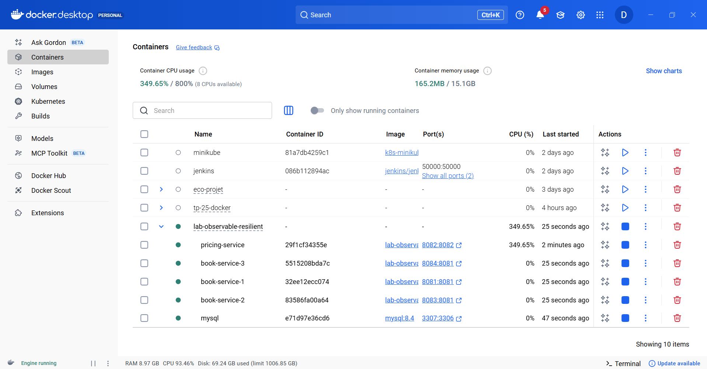

---

##  Lancement des services Spring Boot

Les services Spring Boot sont lancés avec succès depuis IntelliJ IDEA.

###  Démarrage de l’application Book Service

On observe :
- Initialisation de Spring Boot
- Configuration JPA / Hibernate
- Connexion à la base MySQL
- Démarrage du serveur Tomcat

---

##  Déploiement avec Docker

L’ensemble des services est déployé dans des conteneurs Docker via **docker-compose**.

###  Vue globale des conteneurs

Les conteneurs actifs incluent :
- `book-service` (plusieurs instances)
- `pricing-service`
- `mysql`

---

###  Scalabilité des services

Plusieurs instances du **Book Service** sont lancées pour démontrer la **résilience** et la **scalabilité**.

Chaque instance écoute sur un port différent, ce qui permet :
- La répartition de charge
- Une meilleure tolérance aux pannes

---

##  Technologies utilisées

- **Java 17+**
- **Spring Boot 3**
- **Spring Data JPA**
- **MySQL**
- **Docker & Docker Compose**
- **IntelliJ IDEA**
- **Hibernate**
- **Tomcat embarqué**

---

##  Conclusion

Ce TP démontre :
- La mise en place d’une architecture microservices
- Le déploiement et la gestion des services avec Docker
- La capacité à faire évoluer le système avec plusieurs instances
- Une base solide pour l’observabilité et la résilience applicative

---

